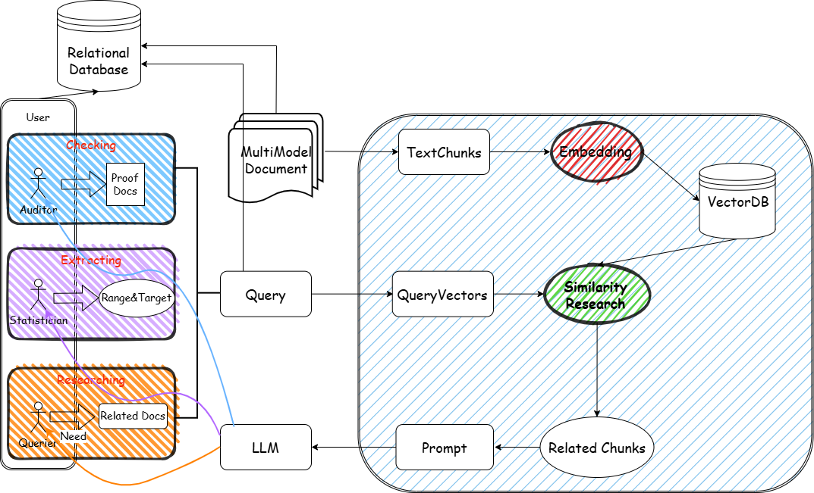
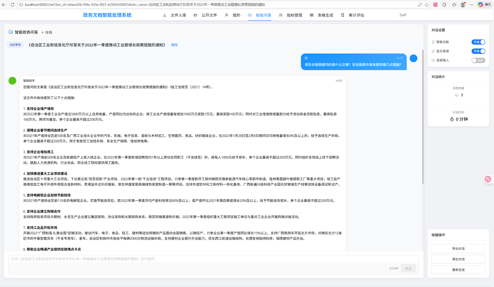
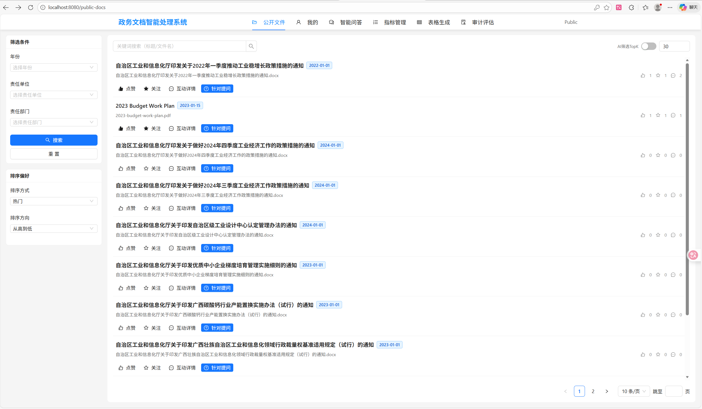
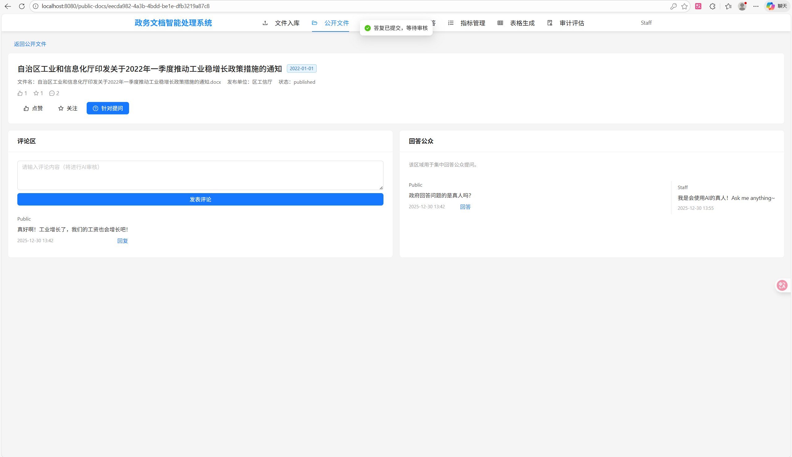
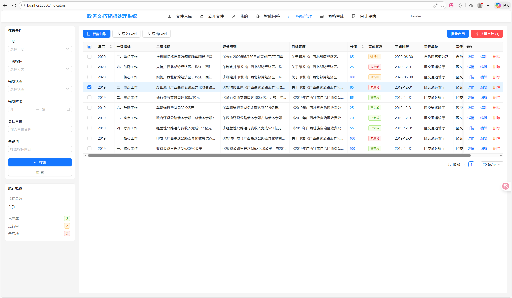
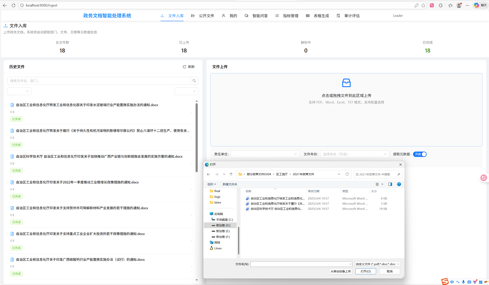
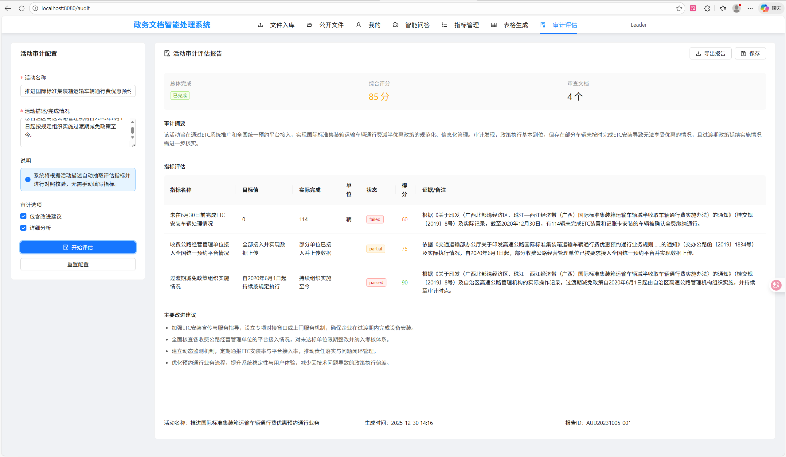

# Policy-RAG

面向政务公开与指标治理的 LLM + RAG + 数据库应用系统。项目在 PrivateGPT 风格的本地 RAG 服务基础上，补充了 Vue 前端、Qwen 调用、Qdrant 向量检索、Postgres 关系数据库、RBAC 权限、公开文件互动、指标抽取、审计评估和本地批量文档入库能力。

> 本项目用于课程设计和本地演示。默认账号、占位密钥和示例配置不能直接用于生产环境。



## 核心能力

- **智能问答**：基于 Qdrant 检索政务文件片段，将证据上下文交给 Qwen 生成可追溯回答。
- **公开文件门户**：按年份、责任单位、热度、点赞、收藏和关键词筛选政策文件，支持评论、提问政府、回答公众。
- **指标抽取与管理**：从政策文件中抽取年度、一级指标、二级指标、评分细则、分值、目标来源、完成时限、责任单位和责任处室，并写入 Postgres。
- **审计评估**：面向指标完成情况记录审计结论、证据和建议，保留可 JOIN、可统计的结构化数据。
- **批量文档入库**：网页上传与本地目录递归入库并存。本地 `documents/` 支持 dry-run、增量 manifest、metadata 推断和 watch。
- **权限控制**：内置 `admin`、`staff`、`leader`、`public` 四类角色，区分上传、删除、指标管理、审计与互动权限。

## 界面预览

| 智能问答 | 公开文件 |
| --- | --- |
|  |  |

| 文件详情与互动 | 指标管理 |
| --- | --- |
|  |  |

| 文件入库 | 审计评估 |
| --- | --- |
|  |  |

## 技术栈

| 层次 | 技术 |
| --- | --- |
| 前端 | Vue 3, Vue Router, Vuex, Ant Design Vue, Axios |
| 后端 | FastAPI, Pydantic, LlamaIndex, Poetry |
| LLM | Qwen via DashScope OpenAI-compatible API |
| 向量检索 | Qdrant |
| 关系数据库 | PostgreSQL, SQL schema, RBAC, policy metadata, indicators, audits, comments |
| 文档入库 | Web upload, recursive local folder ingestion, manifest-based incremental sync |

## 项目结构

```text
policy-RAG/
├── assets/                 # README 架构图与真实界面截图
├── db/                     # Postgres schema、seed 和查询示例
├── documents/              # 本地批量入库目录；真实文档默认不上传
├── frontend/               # Vue 前端
├── private_gpt/            # FastAPI 后端与 RAG 服务
├── scripts/                # 启动脚本与批量入库脚本
├── tests/                  # 后端基础测试
├── settings*.yaml          # profile 配置文件，当前保留在根目录以兼容 loader
├── .env.example            # 本地环境变量示例
└── README.md
```

## 配置文件说明

当前版本暂不迁移根目录 `settings*.yaml`，因为 loader 按 `PGPT_SETTINGS_FOLDER + settings-{profile}.yaml` 读取。后续若迁移到 `config/profiles/`，需要先改 loader 并保留旧路径兼容。

| 文件 | 用途 |
| --- | --- |
| `settings.yaml` | 默认配置，包含服务端口、CORS、存储、Postgres 连接占位变量 |
| `settings-qwen.yaml` | Qwen / DashScope profile，配合 `PGPT_PROFILES=qwen` 使用 |
| `settings-docker.yaml` | Docker 场景配置 |
| `settings-ollama*.yaml` | Ollama 场景配置 |
| `settings-test.yaml` | 测试 profile |

## 快速启动

### 1. 准备环境

- Python 3.11
- Node.js 18+
- Poetry
- PostgreSQL
- 可访问 DashScope 的 Qwen API Key
- 可选 Hugging Face token，用于下载 embedding 模型

安装后端依赖：

```bash
poetry install -E llms-openai-like -E embeddings-huggingface -E vector-stores-qdrant -E ui
```

安装前端依赖：

```bash
cd frontend
npm install
```

### 2. 配置环境变量

复制 `.env.example` 并填入本地值，或在 shell 中设置同名变量。

```bash
PGPT_PROFILES=qwen
DASHSCOPE_API_KEY=<your_dashscope_api_key>
HF_TOKEN=<your_huggingface_token>
PGPT_AUTH_SECRET=<your_auth_secret>
PGPT_INDICATOR_STORE=postgres
PGPT_AUTO_MIGRATE=1
PGPT_POSTGRES_HOST=localhost
PGPT_POSTGRES_PORT=5432
PGPT_POSTGRES_DB=gov_rag
PGPT_POSTGRES_USER=postgres
PGPT_POSTGRES_PASSWORD=<your_postgres_password>
```

Windows 用户也可以编辑 `scripts\run_backend_qwen.cmd` 中的占位符后直接启动。不要把真实 token 提交到 Git。

### 3. 启动后端

```bash
poetry run python -m private_gpt
```

Windows + Qwen 快速启动：

```bat
scripts\run_backend_qwen.cmd
```

后端地址：

- API: <http://localhost:8001>
- Swagger: <http://localhost:8001/docs>

### 4. 启动前端

```bash
cd frontend
npm run serve
```

前端地址：<http://localhost:8080>

## 演示账号

以下账号仅用于本地演示。公开部署前必须修改密码、禁用默认账号，并替换 `PGPT_AUTH_SECRET`。

| 角色 | 用户名 | 密码 | 主要权限 |
| --- | --- | --- | --- |
| 管理员 | `admin` | `admin123` | 用户、文件、指标、删除与审计管理 |
| 工作人员 | `staff` | `staff123` | 文件入库、指标处理、回答公众 |
| 领导 | `leader` | `leader123` | 指标推进、审计查看、回答公众 |
| 公众 | `public` | `public123` | 智能问答、浏览公开文件、评论与提问 |

## 数据库初始化

启用 `PGPT_AUTO_MIGRATE=1` 时，后端启动会自动执行 `db/schema_postgres.sql` 和 `db/seed.sql`。也可以手动执行：

```bash
psql -d gov_rag -f db/schema_postgres.sql
psql -d gov_rag -f db/seed.sql
```

Postgres 承担结构化数据职责：用户、角色、权限、政策文件元数据、文件与 RAG `doc_id` 映射、指标、责任单位、审计证据、评论、点赞、收藏和行为日志。Qdrant 承担非结构化文档块检索职责。

## 批量文档入库

网页端上传适合演示和少量文件。本地已有大量政策文档时，可以放入 `documents/`，按目录推断元数据：

```text
documents/
  2020/
    区工信厅/
      example-policy.pdf
```

先 dry-run：

```bash
poetry run python scripts/ingest_folder.py documents --dry-run --infer-metadata
```

确认后执行增量入库。真实入库前需要允许本地目录入库：

```bash
set LOCAL_INGESTION_ENABLED=true
```

然后执行：

```bash
poetry run python scripts/ingest_folder.py documents --infer-metadata
```

监听新增文件：

```bash
poetry run python scripts/ingest_folder.py documents --infer-metadata --watch
```

补偿同步已有向量库文档到 Postgres：

```bash
poetry run python scripts/ingest_folder.py documents --reconcile --infer-metadata
```

脚本会写入 `local_data/document_ingest_manifest.json`。该文件记录相对路径、文件 hash、`doc_ids`、`policy_id` 和同步状态，默认不上传 Git。

## 测试

后端基础测试：

```bash
poetry run pytest tests
```

前端构建：

```bash
cd frontend
npm run build
```

上传前建议执行敏感信息检查：

```bash
git grep -n -E "(sk-[A-Za-z0-9_-]{20,}|h[f]_[A-Za-z0-9]{20,})"
```

## 路线图

- 将当前根目录 profile 配置迁移到 `config/profiles/`，并在 loader 中保留旧路径 fallback。
- 增强批量入库 UI，展示 manifest、partial success、reconcile 结果和失败详情。
- 增加更完整的 CI：后端测试、前端构建、secret scan 和最小 API smoke test。
- 对指标抽取、评论审核和问答原则做领域微调或更严格的结构化输出约束。

## License

This project is licensed under the Apache License 2.0. See [LICENSE](LICENSE) and [NOTICE](NOTICE).
